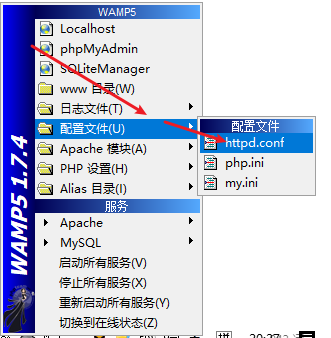

PHP-01

## 服务器端技术介绍
- 为了让同学们对服务器端技术（PHP、MySql数据库、Web服务器）有更深的理解，我们拿几个示例进行讲解

### 注册流程
1. Web服务器负责再服务器负责再服务器打开一个端口用来接收其他电脑的连接
2. PHP负责处理数据
3. 数据库负责保存数据

### 服务器语言
> PHP、Java、Java、Python、Go、erlang、C、C++等

## 走进PHP的世界

### PHP的版本发展历史
1. php1 94年
2. php2 96年
3. php3 98年
4. php4 00年
5. php5 04年
6. php7 15年跳过了php6的版本，运行速度比php5提升了两倍

### PHP的运行方式
1. CLI的方式（了解）
2. HTTP模式（WAMP Server）

### 创建第一个PHP代码
> php 路径名
```php
<? php 
echo  "Hello Word!"
>
```

## 搭建PHP运行环境
- 做服务器开发Web服务器、PHP和数据库基本是必不可少的，所以需要现在电脑上分别安装上相应的软件

  Web服务器软件Apache、Nginx、IIS等
  数据库服务器软件：MySql、Oracle、SQL Server等
## 什么是WAMP
> WAMP Windows+Apache+MySql+PHP的缩写，即这几个软件的继承如那几那包，只需要安装这一个
软件包就包含了这几个软件，大大简化了安装和管理这几个软件的使用
### 下载安装WAMP3
可以从 https://pan.baidu.com/s/lpKOkqhl
一直next 直到 安装路径和是否自启动

### WAMP5的使用
1. 安装
2. 启动、重启、关闭

### PHP与Apache的关系
- PHP的脚本是通过Apache来运行的，所以需要把PHP安装成Apache的一个模块，然后才可以通过Apache来运行，当然这些安装WAMP这个集成包已经都安装好了
1. Apache中加载PHP模块
```bash
LoadModule php5_module "${INSTALL_DIR}/bin/php/php5.6.25/php5apache2_4.dll"
```

2. 添加PHP脚本的文件扩展名
AddType application/x-compress .Z
AddType application/x-gzip .gz .tgz
AddType application/x-httpd-php .php
AddType application/x-httpd-php .php3

总结： Apache服务器加载PHP模块， 通过PHP模块包PHP代码编译成APache能执行的代码

### 网站根目录
> 通过Apache破欸之文件的DocumnetRoot选项来可以根目录
1. 找到配置文件httpd.conf 或者找到安装路径C:\wamp\Apache2\conf




2. 打开文件，找到178行和150行，把路径改成自己想要的网址根目录


3. 修改完成之后必须重新启动服务才能切换到目标路径
## PHP的基本语法

### <? php ... ?> 
```php
<? php 
echo  "Hello Word!"
>
```
### 多余的空格和换行
> 不影响输出和运行,换行被识别为空格
```php
<? php 
  echo "Hello Word!";
  
  echo "Hello Word!";

  echo "Hello Word!";

  echo "Hello Word!";
>
```
### 语句结束符
> ; 分号
1. <? php 是php的开始标记 ?>是结束标记 所有的PHP文件必须包含在这一对标记中
2. 结束标记可以省略不写 他会把结束标记当作再这个文件的最后
```php
<? php 
echo  "Hello Word!";
>
```
### 注释
```php
// 单行注释
# 单行注释

/**
 * 多行注释
 */
```

### 打印输出

```php
$arr = array('a', 'b', 'c');
$name = 'dsadsa';
// echo 原样输出
echo $name;
// var_dump() 输出详细信息
var_dump $name; // string(字符长度) 字符内容
var_dump $arr; // array 数据类型 {[0]=> string(1)'a' [2]=> string(1)' b'  "c"}
// die() exit() 是一个东西两个没名字 都会停止执行后面的代码
  die($name2);
  exit($name);// 不会执行
  echo($arr);// 不会执行
/**
   * print() 
   * printf()
   * print_f()
   * 
   * 只有printf和print_r才能使用占位符
   */
  $name2 = "hello %d";// 占位符
  print($name2);
  printf($name2, "111");
  print_r($name2,"111");
```

### 变量
> 变量是一种容器，用来保存数据
```php
<? php
  $name = 111
?>
```
### 按值传递
```php
<? php
  $num1 = 100;
  $num2 = $num1;
  echo $num1;// 100
  echo $num2;// 100
?>
```

### 按引用传递
```php
<? php
  $num3 = 100;
  // & 代表按引用传递
  $num4 = &$num3;
  $num4 = 500;
  echo $num3;// 500
  echo $num4;// 500
?>
```

### $_GET、$_POST、$_EREQUEST
$_GET PHP中的特殊变量 用来接收GET请求
$_POST PHP中的特殊变量 用来接收POS请求
$_EREQUEST PHP中的特殊变量 用来接收GET请求和POST请求
```php
var_dump $_GET
var_dump $_POST
var_dump $_REQUEST
```
> get
**html**
```html
<!DOCTYPE html>
<html lang="en">

<head>
  <meta charset="UTF-8">
  <meta http-equiv="X-UA-Compatible" content="IE=edge">
  <meta name="viewport" content="width=device-width, initial-scale=1.0">
  <title>Document</title>
</head>

<body>
  <form action="./04.GETPOSTREQUEST.php" method="get">
  <!--必须要又name才能识别提交的字符串 -->
    <input type="text" name="getname" id="">
    <input type="text" name="getpwd" id="">
    <input type="submit" value="提交">
  </form>
</body>

</html>
```
**php**
```php
<?php
  echo $_GET;
  var_dump($_GET);
  echo $_GET["getname"];
  echo $_GET["pwd"];
?>
```

> POST
```html
<!DOCTYPE html>
<html lang="en">

<head>
  <meta charset="UTF-8">
  <meta http-equiv="X-UA-Compatible" content="IE=edge">
  <meta name="viewport" content="width=device-width, initial-scale=1.0">
  <title>Document</title>
</head>

<body>
  <form action="./04.GETPOSTREQUEST.php" method="POST">
    <input type="text" name="postname" id="">
    <input type="text" name="postpwd" id="">
    <input type="submit" value="提交">
  </form>
</body>

</html>
```

```php
<?php

  echo "break";
  // #region  POST方法接收请求到的数据
  echo $_POST;
  var_dump($_POST["postname"]);
  var_dump($_POST["postpwd"]);
  // #endRegion
  
?>
```

> REQUEST
```php
<?php
  // #region  REQUEST接收GET和POST请求
  var_dump($_REQUEST)
  // #endRegion
?>
```

## 数据类型
> php支持8中数据类型
1. 4种标量
| 类型名称 | 实例 | 说明 |
| :---: | :---: | :---: |
| 布尔（boolean） | true，false | 无 |
| 整型（integer） | 整数类型 十六进制:0x39 十进制:1 八进制:077 二进制:1101 | PHP再操作时会化成十进制来使用 |
| 浮点型（floor） | 小数 0.1 2.2 | 无 |
字符串（string） | 以引号（单引号或者双引号）包裹的内容 "11" "撒打算" | PHP种的单引号和双引号是由有区别的 单引号的变量不能解析 双引号中的变量是会被解析的
2. 复合类型
| 类型名称 | 实例 | 说明 |
| :---: | :---: | :---: |
| 数组 （array） | 再一个变量种保存多个值 | 数组分为关联数组和索引数组 还可以分为以为数组和委会数组一级多为数组 |
| 对象 （object）| 对象是面向对象编程（OOP）的基础 | 无 |

3. 特殊类型
| 类型名称 | 实例 | 说明 |
| :---: | :---: | :---: |

| 资源（resource） | 用来保存一个外部的引用，比如打开一个文件之后，返回的就是这个文件的引用： $fq = fopen('1.php') | 无 |
| 空（null） | null只表示值为空，之后可能会有一个值  | 无 |

**索引数组和关联数组**
```php
<?php
  $arr = array('a' => 1, 'b' => 2, 'c' => 3);// a*****1 b*****2 c*****3
  $arr2 = array(1,2,3);// 0*****1 1*****2 2*****3

  foreach ($arr as $key => $value) {
    echo $key.'*****'.$value.'<br />';
  }
?>
```